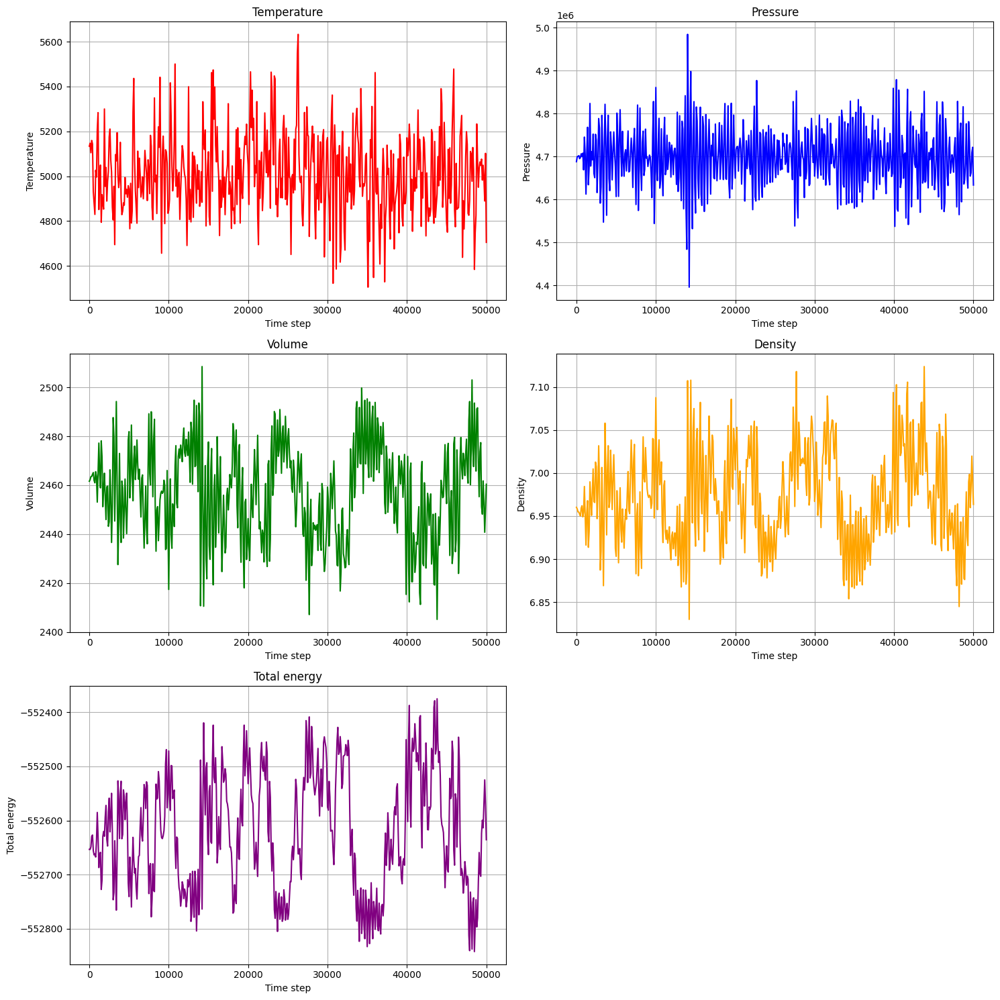
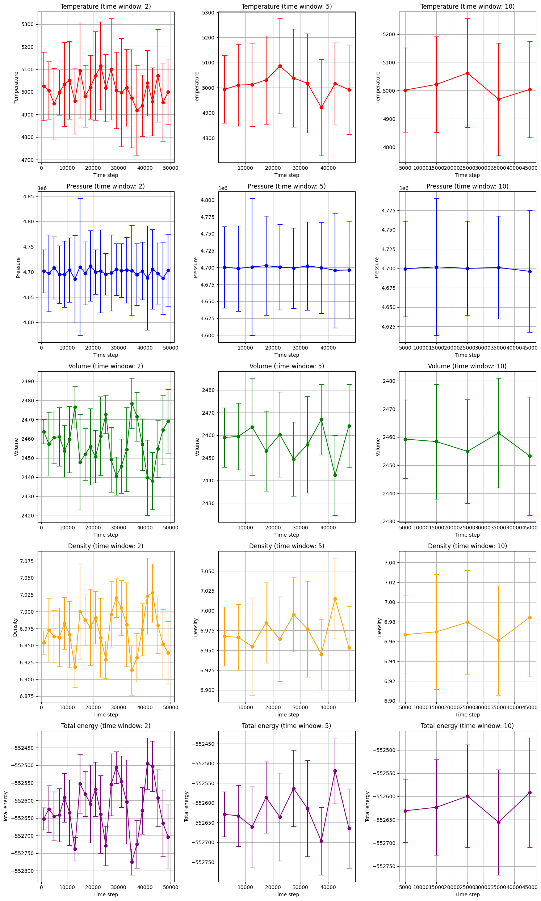
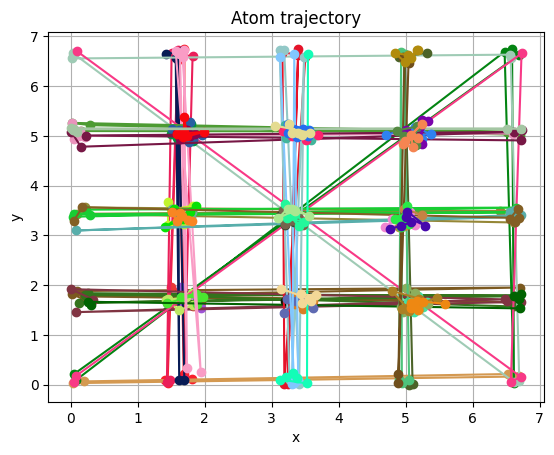
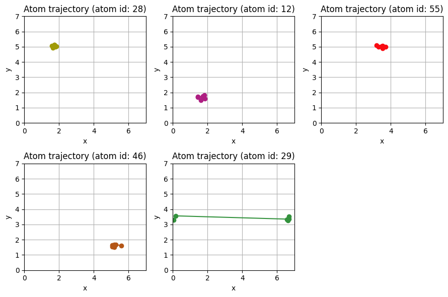
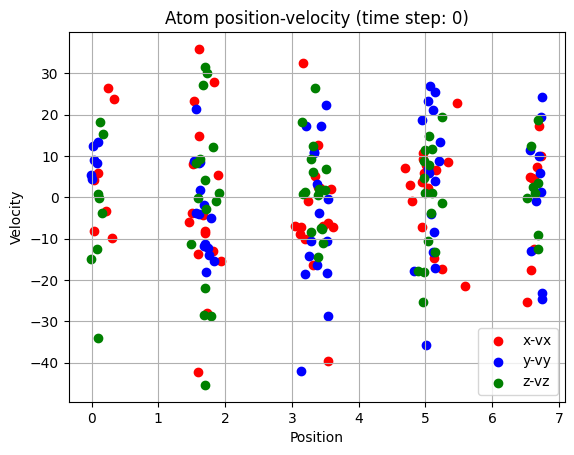
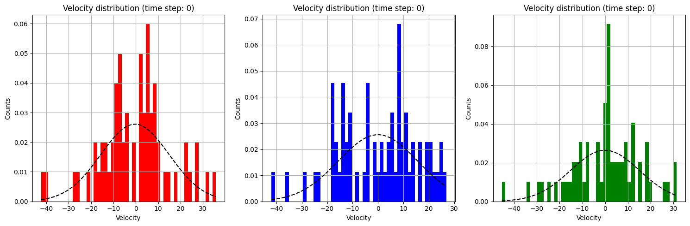

# 分析与结果

## 案例 1 计算立方和

#### 题目分析
目标是从文件中读取非对称数据并进行基础数据处理。

#### 解题策略
为了实现这个目标，我选择了一种直接的方法：通过循环来累加。通过在范围从 1 到给定数字的循环中为每个数字计算立方，然后将这些立方数相加，我能够得到最终的结果。这种方法对于较小的数字非常有效。对于非常大的数字考虑使用解析法：$1^3+2^3+3^3+…+n^3=(\frac{n(n+1)}{2})^2$

#### 结果
计算1到7的立方和为784，正确

## 案例 2 数字排序

#### 题目分析
这个案例涉及数字排序，研究如何使用冒泡排序算法对一组数字进行排序。

#### 解题策略
我们将使用冒泡排序算法来解决这个问题，该算法的基本思想是多次比较相邻的数字并交换它们的位置，直到整个数组排序完成。

#### 结果
对以下数据进行排序：$[64, 34, 25, 12, 22, 11, 90]$

得到：$[11, 12, 22, 25, 34, 64, 90]$

正确

## 案例 3 报数游戏

#### 题目分析
在这个问题中，有30个人在一条船上，超载了，需要15人下船。人们排成一队，排队的位置即为他们的编号。按照报数规则，从1开始，每数到9的人下船，然后循环，直到船上仅剩15人。

这个问题是约瑟夫斯问题的一个变种，其中每第 9 个人将被移出队列，直到只剩下 15 个人。

#### 解题策略
可以使用模拟的方式来解决这个问题。我创建了一个包含 30 个人的列表，并使用一个循环来模拟报数和移除人的过程。我使用了一个索引变量来跟踪当前报数的人，并在每次迭代中更新它。每当索引到达 9 时，我就从列表中移除那个人，并重置索引。

#### 结果
被移除的人：$[9, 18, 27, 6, 16, 26, 7, 19, 30, 12, 24, 8, 22, 5, 23]$

经验证正确

## 案例 4 热力学参量读取

#### 题目分析
这个问题要求我们从给定的数据文件中读取热力学参数的值，然后计算各热力学量的最大值、最小值、均值和标准差。首先，我们需要去除数据文件的头文件，然后读取热力学参数的名称及其个数，最后计算统计数据。

#### 解题策略
1. 去除头文件：通过查找以"Step"开头的行，确定头部的长度，并跳过头文件。
2. 读取热力学参数的名字：从头文件中提取热力学参数的名称。
3. 读取数据：使用NumPy的loadtxt函数读取实际的数据。
4. 计算各热力学量的最大/最小值、均值和标准差：定义一个函数来计算这些统计数据。

#### 结果
| 变量名称 | 均值        | 标准差    | 最小值      | 最大值      |
| -------- | ----------- | --------- | ----------- | ----------- |
| 时间步数 | 25000.000   | 14462.595 | 0.000       | 50000.000   |
| CPU      | 513.232     | 295.216   | 0.000       | 1022.198    |
| 时间     | 25.000      | 14.463    | 0.000       | 50.000      |
| 温度     | 5011.446    | 180.883   | 4505.630    | 5632.723    |
| 压力     | 4699598.518 | 72145.103 | 4396098.500 | 4984438.800 |
| 体积     | 2457.463    | 19.061    | 2405.110    | 2508.530    |
| 密度     | 6.972       | 0.054     | 6.830       | 7.124       |
| 总能量   | -552620.243 | 106.461   | -552842.500 | -552374.940 |


### 4.1 绘制热力学参量线型图

#### 题目分析

使用给定的数据绘制热力学参量的线型图，包括温度、压力、体积、密度和总能量随时间步数的变化。

#### 解题策略

1. 提取时间步数和热力学参量数据：首先，我们需要使用上一题中提供的代码来读取热力学参数的数据文件，包括时间步数、温度、压力、体积、密度和总能量等。

2. 绘制热力学参量线型图：接下来，我们将使用Matplotlib库来绘制热力学参量的线型图。具体步骤如下：

   a. 调用`extract_thermodynamic_data`函数：这个函数用于提取时间步数和热力学参数的数据。它返回时间步数（steps）、各热力学参数的数据（parameters）以及对应的参数名称（parameter_names）。

   b. 创建图形和子图：我们创建一个具有3行2列的子图布局，以容纳不同的热力学参量图。每个子图将用于绘制一个热力学参数的线型图。

   c. 在不同的子图中绘制线型图：我们使用一个循环遍历各个热力学参数，并在每个子图中绘制相应的线型图。

#### 结果




### 4.2 绘制热力学参量不同时间平均（2, 5, 10）下的误差棒图

#### 题目分析

根据给定的时间窗口（2, 5, 10）来计算热力学参量在不同时间平均下的误差，并绘制相应的误差棒图。我们需要计算每个时间窗口内的平均值和标准差，然后以时间步数为横轴，热力学参数为纵轴，绘制误差棒图。

#### 解题策略

1. 提取时间步数和热力学参量数据：首先，我们使用之前提供的代码来读取热力学参数的数据文件，包括时间步数和各热力学参数的数据。

2. 计算误差和平均值：对于每个热力学参数，我们根据不同的时间窗口（2, 5, 10）计算平均值和标准差。这些值将用于绘制误差棒图。

3. 绘制误差棒图：使用Matplotlib库来绘制误差棒图。具体步骤如下：

   a. 创建子图布局：创建一个具有5行3列的子图布局，以容纳不同热力学参数在不同时间窗口下的误差棒图。

   b. 在每个子图中绘制误差棒图：对于每个热力学参数和时间窗口组合，我们在子图中绘制相应的误差棒图。误差棒图包括平均值、标准差和时间步数。

#### 结果




## 案例 5 

#### 题目分析

读取原子参数，将不同构型参量读入同一个变量，读取盒子大小变化，将原子参量按照ID序号进行排序，以及分析某个原子参量随时间的变化。

#### 解题策略

1. **读取原子参数数据**：读取提供的数据文件。
2. **整合不同构型参量**：分析文件中的结构，我可以逐行读取数据，并将不同构型的参数存储在同一个数据结构中，这样我们就可以轻松地访问它们。
3. **读取盒子大小变化**：在数据文件中查找特定的标记，识别盒子大小的边界信息，并计算出盒子的大小。
4. **按照ID序号排序原子参数**：使用了NumPy库来对原子参数按照ID的升序排列。
5. **分析某个原子参量随时间的变化**：实现了一个函数，接受原子的ID作为输入，并返回该原子参数随时间的变化数据。

#### 结果

```python
array([[  1.       ,   1.       ,   1.69979  ,   6.74335  ,   0.0816924,
         -8.24524  , -24.5227   , -12.5047   ],
       [  1.       ,   1.       ,   1.68936  ,   0.219332 ,   6.60759  ,
          9.08351  ,   1.82534  ,  18.1235   ],
       [  1.       ,   1.       ,   1.60721  ,   6.52775  ,   0.190837 ,
         -5.30778  ,  16.6408   ,   3.62636  ],
       [  1.       ,   1.       ,   1.44847  ,   0.0322972,   0.123265 ,
         -2.06136  ,   2.91722  ,   8.78817  ],
       [  1.       ,   1.       ,   1.40437  ,   0.0851379,   6.67536  ,
          8.01946  ,  -5.69507  , -12.7257   ],
       [  1.       ,   1.       ,   1.81293  ,   0.104421 ,   6.66555  ,
          3.68318  ,  -4.24986  ,  -5.96853  ]])
```

### 5.1 绘制原子的平面运动轨迹

#### 题目分析

绘制指定原子的平面轨迹，并以不同颜色区分不同的原子。

#### 解题策略

1. **绘制指定原子的平面轨迹图**：首先，我们实现了一个函数 `draw_atom_trajectory`，它可以绘制指定原子的平面轨迹。该函数接受原子的ID和颜色作为参数，并使用原子参数数据来提取x和y坐标，然后绘制轨迹图。
2. **生成随机颜色**：为了区分不同的原子，我们编写了一个函数 `random_color`，它可以生成随机的颜色值，以便每个原子的轨迹都有不同的颜色。
3. **绘制所有原子的平面轨迹图**：实现一个函数 `draw_all_atom_trajectory`，它遍历所有的原子并调用 `draw_atom_trajectory` 函数来绘制它们的轨迹。这样，我们可以在同一图中看到所有原子的运动。
4. **随机挑选五个原子分别绘制平面轨迹图**：为了更清晰看出每个原子的运行轨迹，分别绘制出五个原子的图。

#### 结果

**所有原子平面轨迹图**



**随机五个原子的轨迹图**



大多数原子都是在自己的位置附件移动，但发现29号原子跨越了整个区域。


### 5.2 位置-速度(x-vx, …)散点分布图

#### 题目分析

在一个图中显示原子在三个坐标轴（x、y、z）上的位置和速度的散点分布。

#### 解题策略

1. **提取指定时间步数的原子参数**：由于我们要绘制特定时间步数的散点图，我们需要编写一个函数 `read_atom_parameter_by_time_step` 来提取给定时间步数的原子参数。
2. **绘制散点图**：接下来，我们可以编写一个函数 `draw_atom_scatter` 来绘制散点图。在这个函数中，我们将使用 `plt.scatter` 函数来绘制 x、y、z 坐标对应的速度分布散点图，每个坐标的速度使用不同的颜色表示。

#### 结果



从分布图可以看出在盒子中间的原子数量更多。

从原子的轨迹图和和分布图综合可以看出原子是分布在一些离散的格点上，这些位置可能代表势阱

### 5.4 速度分布直方图

#### 题目分析

在三个坐标轴（x、y、z）上绘制速度分布直方图，并拟合每个分布的正态分布曲线。

#### 解题策略

1. **提取指定时间步数的原子参数**
2. **绘制速度分布直方图**：编写一个函数 `draw_atom_velocity_distribution` 来绘制速度分布直方图。其中使用 `plt.hist` 函数来绘制速度分布的直方图，并使用不同颜色表示 x、y、z 坐标对应的速度分布。同时计算每个分布的正态分布拟合曲线，并绘制在图上。

#### 结果



### 案例6 非均匀结构数据读取


#### 题目分析

读取非均匀结构数据，储存到DataFrame中。

#### 解题策略

1. **查看数据结构**：通过数据文件可知，数据是以时间步为单位组织的，每个时间步都有一个块数量和总数，对于每个时间步，后续的几行数据都与具体的块相关，包括块编号、坐标、粒子数、密度和动能。
2. **解析数据**：逐行读取文件内容，将每一块的数据保存为一个DataFrame。

#### 结果

|      | Chunk | Coord1   | Ncount   | density/mass | c_keatom     |
| ---- | ----- | -------- | -------- | ------------ | ------------ |
| 0    | 1     | 3.99663  | 1024.000 | 3.772460     | 3.067540e-02 |
| 1    | 2     | 11.99660 | 1024.000 | 3.772460     | 2.249220e-06 |
| 2    | 3     | 19.99660 | 1024.000 | 3.772460     | 1.111200e-04 |
| 3    | 4     | 27.99660 | 1024.000 | 3.772460     | 2.360650e-02 |
| 4    | 5     | 35.99660 | 256.077  | 0.943399     | 3.777430e-08 |

